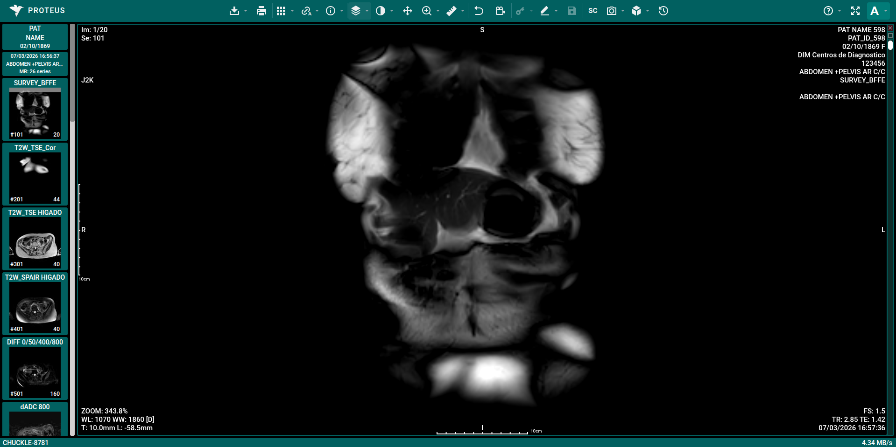

# DICOM Viewer

The DICOM Viewer is the main mode for reviewing and analyzing medical images. It provides comprehensive tools for image manipulation, measurement, and navigation.

## Documentation

- [Toolbar Guide](./toolbar.md) - Detailed explanation of all tools and icons
- [Viewport Guide](./viewport.md) - Context menu and viewport interactions
- [Navigation Bar Guide](./navbar.md) - Information about browsing studies and series
- [Key Objects Guide](./key-objects.md) - Marking and managing selected images
