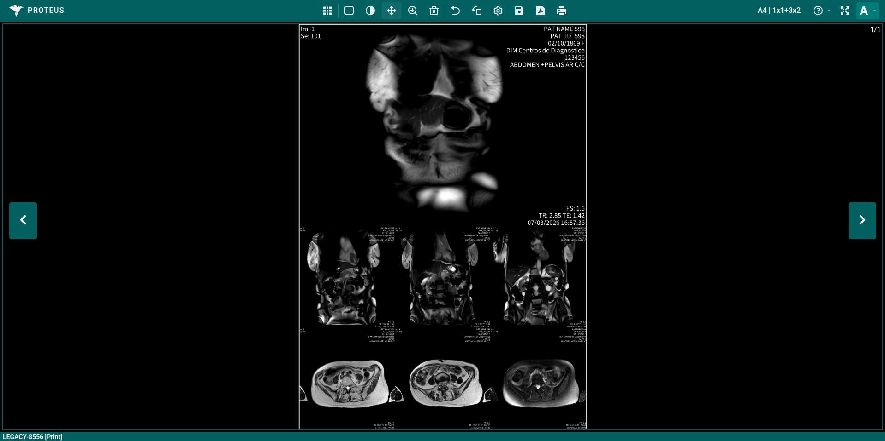

# Editor de Película

El Editor de Película permite crear diseños de imagen personalizados y enviarlos a una impresora o exportarlos como archivo para fines de informes y documentación.

## Documentación

- [Guía de Barra de Herramientas](./toolbar.md) - Explicación detallada de todas las herramientas e iconos
- [Guía del Lienzo](./canvas.md) - Páginas, celdas de imagen y menú contextual
