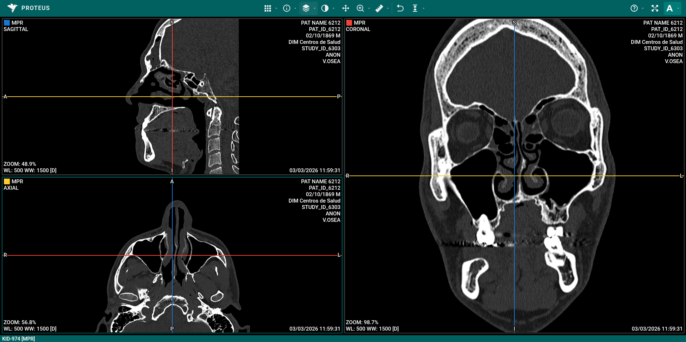

# Reconstrucción Multiplanar (MPR)

El modo MPR permite visualizar datos volumétricos reconstruidos en múltiples planos simultáneamente, con soporte para los modos de proyección MIP, MinIP y Promedio.

## Documentación

- [Guía de Barra de Herramientas](./toolbar.md) - Explicación detallada de todas las herramientas e iconos
- [Guía de Ventanas](./viewports.md) - Planos, diseños, maximizar y modos de renderizado
